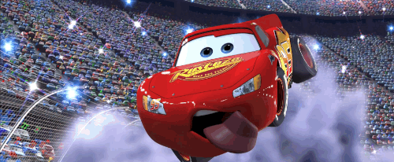

# Capstone 2 - Machine Learning

# Training My Computer to Distinguish Car Types

-------

## Mission

Wouldn't it be amazing if my computer could recognize what a car's body type is just from an image of a car? That is exactly what I set out to do.

This could be utilized to detect cars passing through traffic to collect data. Some useful metrics that could be derived:

-Road Wear
-Improving data for business metrics
-Making sure trucks are not in the left lane

## Dataset

[Stanford Cars Dataset](https://www.kaggle.com/eduardo4jesus/stanford-cars-dataset)

The dataset consists of 16,185 images of cars, of which only the 8,144 training images are labeled with car names. There are 196 unique cars within this dataset. The test set are not labeled with a description. 

Input:

Car Image

Target that came with the dataset: 

Car Description

------

## EDA

Upon looking at the dataset initially, I realized that 196 unique cars (196 targets) was too many targets to predict on. I worked on boiling down the 196 car names into more elementary categories. A good chunk of time was dedicated to parsing through the car names to determine which bin it would fall under. These are the 6 bins of cars I settled on along with the numbers observed of each.

I also wanted a MVP in case 6 classes were too difficult to distinguish for the computer, thus I decided to combine/split the 6 classes into two classes:

**Cars**: coupes, sedans, convertibles 

**Trucks**: vans, trucks, SUVs

## Modeling

Initial 2 Class Model:

81% Validation Accuracy

Initial 6 Class Model:

37% Validation Accuracy

Final 2 Class Model:

Increased complexity with more filters and dense layers.

85% Validation Accuracy

Final 6 Class Model:

Got rid of the dropout layer and decreased the complexity.

51% Validation Accuracy

## Struggles

### AWS

I spent over 2 days trying to figure out how to spin up a GPU instance on an EC2 instance but the EC2 linux jupyter instance kept crashing upon importing tensorflow. This issue was not remedied so I pivoted to Google Colab to utilize a GPU to train my model.

### Sigmoid

I initially had both models using the Sigmoid activation function for the final layer which presented a strange problem late into the project. I looked at the test prediction weights and they all fell on 1 or close to 1.

And yet the accuracy of sigmoid was quite high at 55% 

## Results

### Cars that the model has never seen before!

## Acknowledgements

**3D Object Representations for Fine-Grained Categorization**

Jonathan Krause, Michael Stark, Jia Deng, Li Fei-Fei

*4th IEEE Workshop on 3D Representation and Recognition, at ICCV 2013 (3dRR-13). Sydney, Australia. Dec. 8, 2013.*
