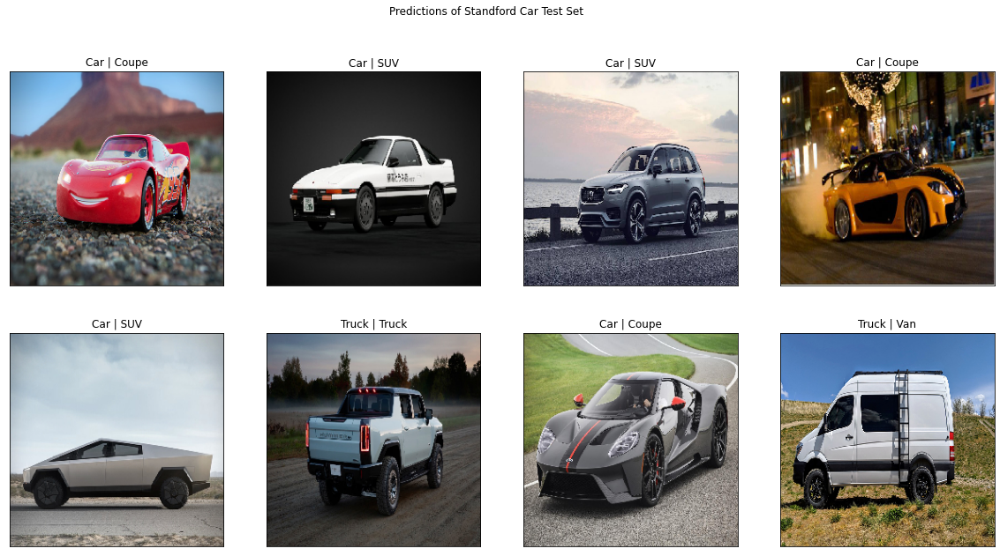

# Capstone 2 - Machine Learning

# Training My Computer to Distinguish Car Types

-------

  

## Mission

Cars are the main type of transportation around the globe. Being able to recognize the type of car on the roads could produce some great data.
This could be utilized to detect cars passing through traffic to collect data. Some useful metrics that could be derived:

-Road Wear

-Improving data for business metrics

-Making sure trucks are not in the left lane

*Also it would be super awesome to see what the AI thinks of exotic/fictional/cartoon cars!*
## Dataset

[Stanford Cars Dataset](https://www.kaggle.com/eduardo4jesus/stanford-cars-dataset)

The dataset consists of 16,185 images of cars, of which only the 8,144 training images are labeled with car names. There are 196 unique cars within this dataset. The test set are not labeled with a description. 

Peek at what the data looks like

  

------

## EDA

Upon looking at the dataset initially, I realized that 196 unique cars (196 targets) was too many targets to predict on. I worked on boiling down the 196 car names into more elementary categories. A good chunk of time was dedicated to parsing through the car names to determine which bin it would fall under. These are the 6 bins of cars I settled on along with the numbers observed of each.

  

I also wanted a MVP in case 6 classes were too difficult to distinguish for the computer, thus I decided to combine/split the 6 classes into two classes:

**Cars**: coupes, sedans, convertibles 

**Trucks**: vans, trucks, SUVs

  

## Modeling

The first thing I did was downsample the resolution to 256x256 and grayscale all the images to reduce the training time. I tested many variations of layer combinations, batch norms, dropouts, and other parameters which improved my validation accuracy from random guessing to the final custom model validation accuracy scores you see below.

### Custom Model: 

|2 Classes |6 Classes |
|:------------------------:|:-------------------------:|
|  |  |
|  |  |
| 88.3% Validation Accuracy | 56% Validation Accuracy |

### Model Comparison

  
  

ResNet50 yielded the best results on this particular dataset with a validation accuracy of 95% and 79% on the 2 class and 6 class respectively, beating my custom CNN model by a fairly large margin. 

## Results

### Cars that the model has never seen before!

## Further Consideration

With more time I would like to focus in on where the car is and keep the ratio of the cars. The squeezing and stretching of the images to reach a perfect square likely threw off the model and caused strange angles that did not belong on that class of cars.
Currently the model can reliably predict on images with clear images of cars in the middle of the screen, but I would love to have a model that can predict on videos. In the future I would like to train this on an object detection framework.

  

## Acknowledgements

**3D Object Representations for Fine-Grained Categorization**

Jonathan Krause, Michael Stark, Jia Deng, Li Fei-Fei

*4th IEEE Workshop on 3D Representation and Recognition, at ICCV 2013 (3dRR-13). Sydney, Australia. Dec. 8, 2013.*
